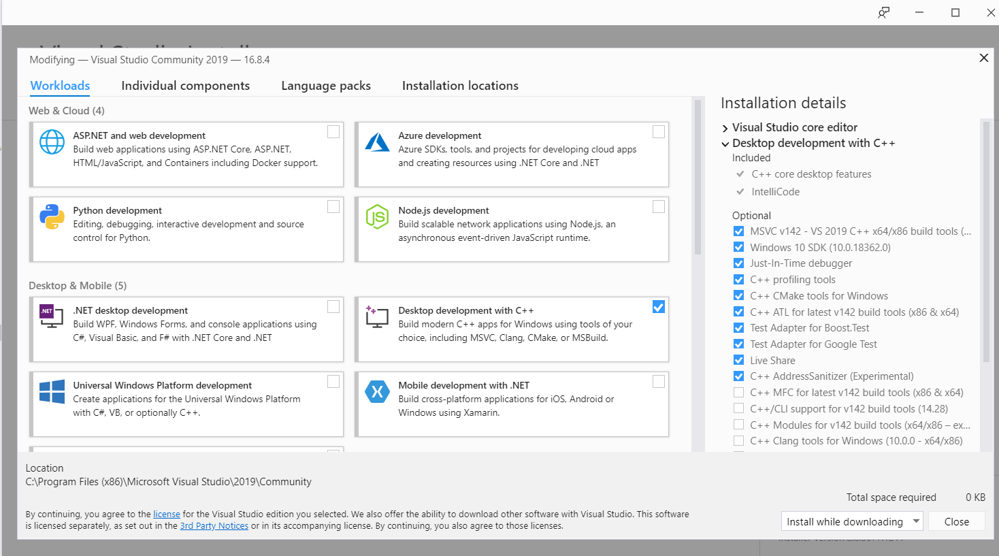

# Introduction

This code processes a video, detects all the different faces appeared through the video and notify the user in the end by saving all the faces detected and plotting the summary. The summary is a histogram which indiates the duration of every person appeared in the video.

There are two modes for processing a video. You can either set it to video mode which will iterate through a directory and process all the videos inside one by one. OR you can set mode value to recorder and give a keyword value which will work as a screen recorder for an opened window having the keyword in its title. The recorder works for background windows as well.

The code uses face_recognition api. The Github link for the api is given below:

https://github.com/ageitgey/face_recognition

# How to set up the Environment:

Before you run the code, you would need to install the some packages mentioned in the requirements.txt. You can simply run the following command while in the project direcotory.

    pip install -r requirements.txt

Make sure that you have dlib installed already in your PC. To install dlib, you would need to install Visual Studio build tools which can be done as follows:

- Download Visual Studio installer from the link here: https://visualstudio.microsoft.com/downloads/

- Run the installer and under Workloads tab, select Desktop Development with C++. Make sure to check MSVC build tools and leave everything as default as shown in the figure below. Click Install and download.

- Then install dlib by running the following command:

        pip install dlib

Once you install dlib, you will then be able to install face_recognition api from the link given above.

# How to run the code:

The code can be run with cmd command with some flags to specify which are user's choice. The flags description are:

- **--mode:** Mode to run the program accordingly. Modes values are; video, recorder, default is "video".
- **--input_path:** Path to the input directory where videos are placed, defaultis "videos".
- **--output_path:** path to output directory where results will be saved, default is "results".
- **--keyword:** keyword works when mode is recorder. Keyword specify (any keyword) in the title of a Window which you want to record.
- **--null_frames_threshold:** Stops processing when no face is detected null_frames_threshold times while recording a screen, default is 15.
- **--view:** Preview Video and plots during processing, default it False.
- **--step:** pick nth frame to process in the vidoe. default is 30 meaning take a frame after 1 sec if video is 30FPS.
- **--frames_difference:** A new face is recognised in nth consecutive frames will be considered as a new person, default is 10.
- **--gpu:** Specify whether to use GPU, default is False.
- **--distance_threshold:** How much distance between faces to consider it a match. Lower is more strict. 0.5 is typical best performance.
- **--resize_scale:** Resize the input video, e.g. 0.75 will resize to 1/4th of the video. default is 1 means No resize.
- **--verbose:** shows the log level in the cosole. Set it to zero to show nothing in the console.

A sample command for videos can be like:

    python run.py --mode=video --input_path=videos --output_path=results --frames_difference=5 --step=120 distance_threshold=0.7

A sample command for screen recorder can be like:

    python run.py --mode=recorder --keyword=Calculator --output_path=results --frames_difference=5 --step=120 distance_threshold=0.7 --null_frames_threshold=15